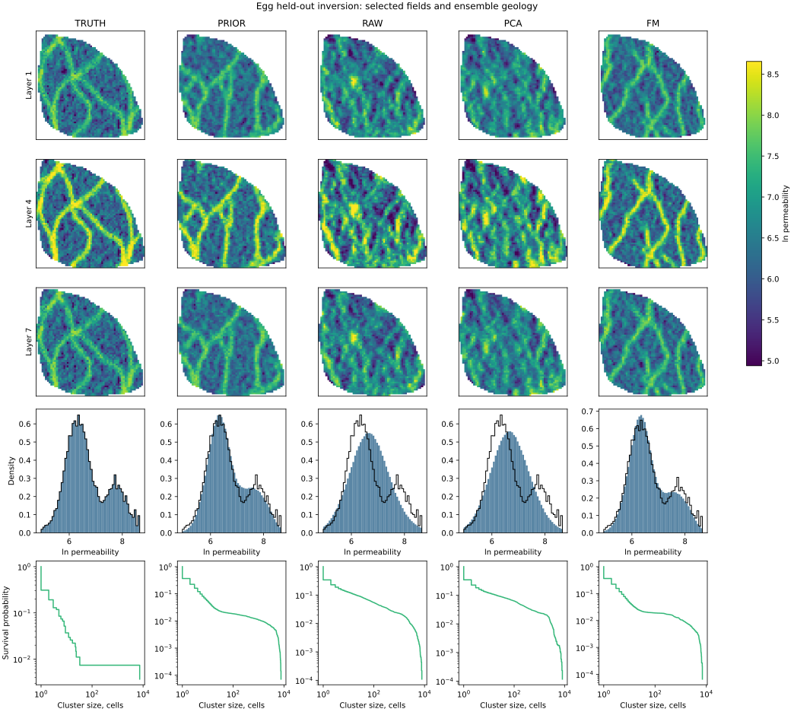

# History Flow Matching

Research code for evaluating flow-matching parameterizations of geological
models in ensemble data assimilation. The experiments compare direct log
permeability, PCA, and flow-matching latent variables on the PUNQ-S3 and Egg
reservoir benchmarks.

The project prioritizes reproducibility: experiment parameters are configured
in YAML, stochastic components use explicit seeds, and reported values are
derived from provenance-bearing raw artifacts.

## Status

The cross-platform `uv` environment, storage-safe OPM Flow runner, Egg
raw/PCA/FM inversion, controlled source ablation, and U-Net/UNO
cross-resolution experiment are implemented with content-addressed artifacts.
M0 is verified against SPE1 with Flow 2026.04. PUNQ-S3 assimilation remains
blocked because the available truth deck fails the published-FOPT validation
gate; no PUNQ benchmark result is claimed. Measured details are in
[`REPORTS/REPORT.md`](REPORTS/REPORT.md), the execution environment is in
[`ENVIRONMENT.md`](ENVIRONMENT.md), and exact commands are in
[`REPRODUCE.md`](REPRODUCE.md).

## Scientific results

The complete measured scientific report is available at
[`REPORTS/REPORT.md`](REPORTS/REPORT.md). Publication figures are stored as
GitHub-viewable SVG files and matching vector PDFs.

- Egg posterior comparison: [SVG](results/figures/egg_posterior_comparison.svg) · [PDF](results/figures/egg_posterior_comparison.pdf)
- Water-cut forecast: [SVG](results/figures/egg_water_cut_forecast.svg) · [PDF](results/figures/egg_water_cut_forecast.pdf)
- Flow-matching source ablation: [SVG](results/figures/egg_source_ablation.svg) · [PDF](results/figures/egg_source_ablation.pdf)
- Source inversion comparison: [SVG](results/figures/egg_source_inversions.svg) · [PDF](results/figures/egg_source_inversions.pdf)
- Cross-resolution ablation: [SVG](results/figures/ablation_resolution.svg) · [PDF](results/figures/ablation_resolution.pdf)

## Development

Python 3.11 or newer and [`uv`](https://docs.astral.sh/uv/) are required.
Setup and experiment commands will be maintained in `REPRODUCE.md` as each
milestone is validated.
